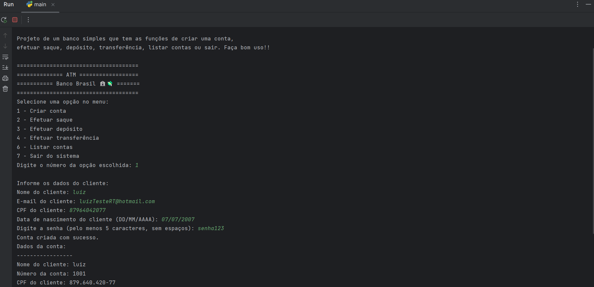

  
# Projeto - Banco
Projeto realizado durante o curso "Programação em Python do Básico ao Avançado" - Geek University.


---

## Descrição
> Devemos desenvolver uma aplicação onde ao ser inicializada solicite ao usuário escolher o
que deseja fazer no banco, como criar uma conta, efetuar saque, efetuar depósito, efetuar
transferência, listar contas ou sair do sistema

## Sobre esse projeto

Este projeto foi desenvolvido como parte do curso "Programação em Python do Básico ao Avançado" da Geek University. É uma aplicação de banco simples em Python que permite aos usuários realizar operações bancárias básicas, como criar uma conta, efetuar saque, efetuar depósito, efetuar transferência, listar contas e sair do sistema.

## Funcionalidades

- **1. Criação de Contas**: 
Os usuários podem criar novas contas bancárias, inserindo informações como nome, e-mail, CPF e data de nascimento. Além disso, uma senha é adicionada para garantir a segurança da conta.

- **2. Operações Bancárias**:

   **Efetuar Saque**: Permite aos usuários de conta realizar saques, informando o valor desejado.

   **Efetuar Depósito**: Permite aos usuários de conta fazer depósitos em suas contas, especificando o valor.

   **Efetuar Transferência**: Os usuários de conta podem transferir dinheiro entre contas, fornecendo o número da conta de destino e o valor da transferência.

- **3. Listagem de Contas**: Os usuários podem listar todas as contas criadas, exibindo informações detalhadas sobre cada uma, como número da conta, nome do titular e saldo total.

- **4. Validações**: O sistema inclui validações para garantir a integridade dos dados inseridos, como CPF válido, e-mail válido, senha segura e data de nascimento correta.


## Melhorias Feitas

Comparando o código inicial com o código aprimorado, várias melhorias foram implementadas:

- Tratamento de exceções para evitar falhas inesperadas.
- Mensagem inicial informativa e resumo das funcionalidades.
- Validação de CPF.
- Adição de senha para segurança do cliente.
- Validação de e-mail.
- Validação de data de nascimento.
- Mensagens de erro claras e informativas.
- Opção de sair do sistema no menu.
- Verificação de números de conta existentes.
- Melhorias na formatação das mensagens.


## Como Usar

1. Clone este repositório em seu computador:

    ```shell
    git clone https://github.com/LuisFelipe-Santos/Banco.git
    ```

2. Navegue até o diretório do projeto:

    ```shell
    cd Banco
    ```

3. Execute o arquivo `main.py`:

    ```shell
    python main.py
    ```

4. Siga as instruções no console para interagir com o banco.

## Capturas de Tela

#### Tela Principal

#### Criação de conta

#### Projeto em sua versão inicial

## Contribuindo

Sinta-se à vontade para contribuir para este projeto. Você pode reportar problemas, criar solicitações de melhoria ou enviar suas próprias alterações. 😊

## Autor

- [Luís Felipe](https://github.com/LuisFelipe-Santos) - Desenvolvedor

---
## Tecnologias Utilizadas

- Python

## Bibliotecas Utilizadas

- `datetime`: Para manipulação de datas.
- `re`: Para expressões regulares (usado na validação de e-mail).
- `typing`: Para anotações de tipo.
- `time`: Para introduzir pausas no programa.
